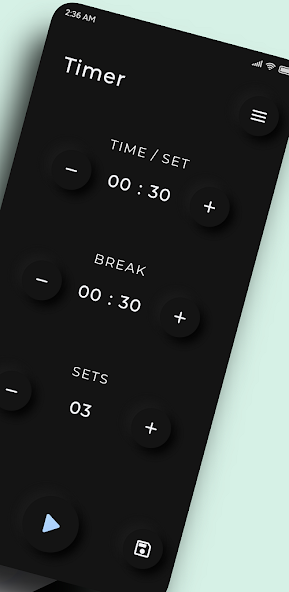

# Workout Timer - Flutter App

# Workout Timer Mobile Application

The Workout Timer Mobile Application is a Flutter-based mobile app designed to enhance the workout experience. It provides a comprehensive set of features including a workout timer with voice assist, highly customizable HIIT (High-Intensity Interval Training) timer, workout preset saving, and performance statistics tracking.

## Installation

To install and run the Workout Timer Mobile Application, follow these steps:

1. Clone this repository to your local machine.
2. Ensure you have Flutter and its dependencies installed on your system.
3. Run `flutter pub get` to install the required dependencies.
4. Connect your Android or iOS device, or use an emulator.
5. Run `flutter run` to launch the application on your device.

## Usage

- Set your desired workout intervals, rest periods, and repetitions in the customizable timer.
- Activate voice assistance for real-time guidance and motivation during your workouts.
- Save and load workout presets for convenient access to your preferred routines.
- Track your performance statistics to monitor progress and analyze your workout performance over time.

## Contributing

Contributions are welcome! If you encounter any bugs, have feature requests, or would like to contribute to the development of the Workout Timer Mobile Application, please follow the [contribution guidelines](CONTRIBUTING.md).

## Contact

For any further inquiries or feedback, please contact [Aman Verma](mailto:amanvermanbd11111@gmail.com).

